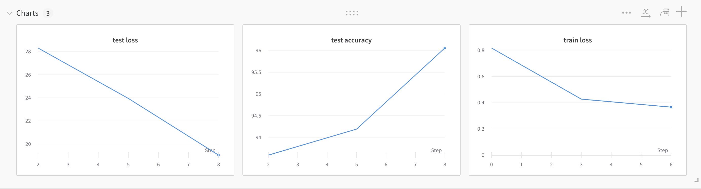
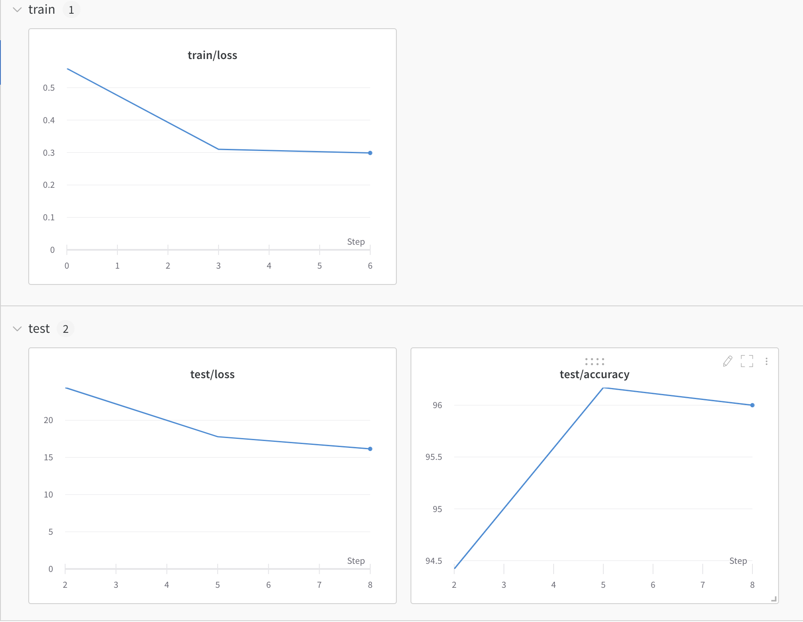
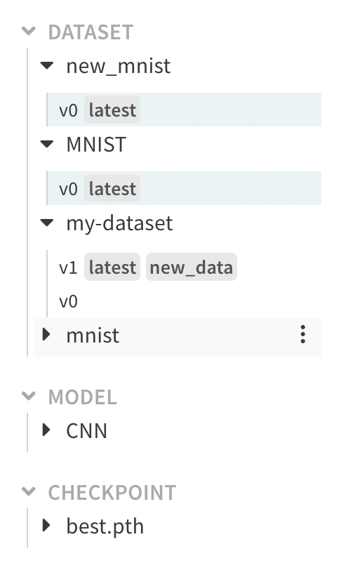
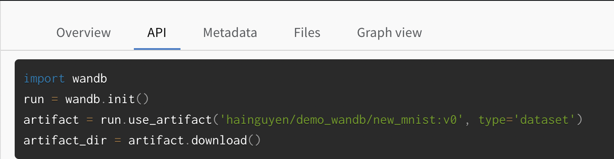

# Simple MNIST Wandb Demo
This is a simple project, which is integrated with Wandb for experiments tracking, as well as data and model version controlling

## Wandb Install and Setup
First we need to install wandb via `pip`:
```bash
pip install wandb
```
or `conda`:
```bash
conda install -c conda-forge wandb
```
Login `wandb` account for further tracking and version controlling:
```bash
wandb login
```

## Start a new run
Initialize a new run in W&B with `wandb.init` we start will start tracking system metrics and console logs, right out of the box.
```bash
import wandb
wandb.init(project = 'wandb_demo', config = config, tags = ['training cnn'])
 ```
Where `project` is the name of the project, `config` is a pre-defined dictionary of hyperparameter that we want to apply for the experiment, and `tags` for faster tracking and filtering while we have several experiments
 
Moreover, you can have wandb automatically resume runs by passing `resume=True` to `wandb.init()`. If your process doesn't exit successfully, the next time you run it wandb will start logging from the last step.

## Tracking gradient with wandb.watch()
`wandb.watch` will log the gradients and the parameters of your model, every `log_freq` steps of training.

All you need to do is call it before you start training:

```bash
def train(model, epoch, trainloader, optimizer, loss_function):
    wandb.watch(model, log_freq=10)
    
    model.train()
    running_loss = 0

    for i, (input, target) in enumerate(trainloader):
        # zero the gradient
        optimizer.zero_grad()

        # forward + backpropagation + step
        predict = model(input)
        loss = loss_function(predict, target)
        loss.backward()
        optimizer.step()
```

## Tracking losses and other with wandb.log()
We can simply call `wandb.log(dict)` to log a dictionary of metrics or custom objects to a step. Each time we log, it increments the step by default, so the metrics can be viewed over time

For simple tracking training and testing progress, simply run:
```bash 
wandb.log({'train loss': total_loss}) 
```
and 
```bash 
wandb.log({'test loss':test_loss, 'test accuracy': test_accuracy})
```



### Re-orginized logged charts and panels
The above logging style only log all chart to 1 panel, which will be very confusing when having more chart and when we want to group these charts for easier access.

In `wandb`, `/` is treated as a separator for organizing logged panels in the W&B UI. By default, the component of the logged item's name before a `/` is used to define a group of panel
```bash 
wandb.log({'train/loss': total_loss}) 
```
and 
```bash 
wandb.log({'test/loss':test_loss, 'test/accuracy': test_accuracy})
```
This will create and group logged charts into 2 panels: `train` and `test`.



## Dashboard 
Dashboard is a summary table of all runs in the project:


We can easily find and access desired runs with `filter` and `groups` features. `tags` also supports in faster finding specific run during tracking.

## Version Controlling with wandb Artifact
Conceptually, an `artifact` is simply a directory in which we can store whatever we want. We can store dataset, models or checkpoints, ... with Artifact.

Every time we change the contents of this directory, W&B will create a new version of that artifact instead of simply overwriting the previous contents.

An example of artifact dictionary:



The first artifact upload version is set as `v0`, the next change version will be set with `v1` and `v2`, ... 

The aliases `latest`, `new_data`, ... help in highlighting the importance of each artifact version.

### Dataset Version Controlling
Logging and controlling dataset version:
```bash
artifact = wandb.Artifact(DATASET_NAME, type='dataset')
artifact.add_dir(DATA_PATH)
run.log_artifact(artifact)
```

### Model Version Controlling 
Saving checkpoint of model:
```bash
ckpt_best_artifact = wandb.Artifact(CKPT_PATH + 'best.pth', type = 'checkpoint')
ckpt_last_artifact = wandb.Artifact(CKPT_PATH + 'last.pth', type = 'checkpoint')

wandb.run.log(ckpt_last_artifact, aliases=['last'])
wandb.run.log(ckpt_best_artifact, aliases=['best'])
```
Here, `aliases` is used to highlight the important versions in a list of artifacts.

### Restore artifact for further usage:
An example of restore best checkpoint in the past for continue training and testing:
```bash
import wandb
run = wandb.init()
artifact = run.use_artifact('hainguyen/demo_wandb/best.pth:v0', type='checkpoint')
artifact_dir = artifact.download('new/')
```
We can pass the desired download location in `artifact.download()`

We can easily find the api for restore artifact on wandb:



Here, `Metadata` is a dictionary of related information and features we want to save. `Files` include logging data for latter restoring.
